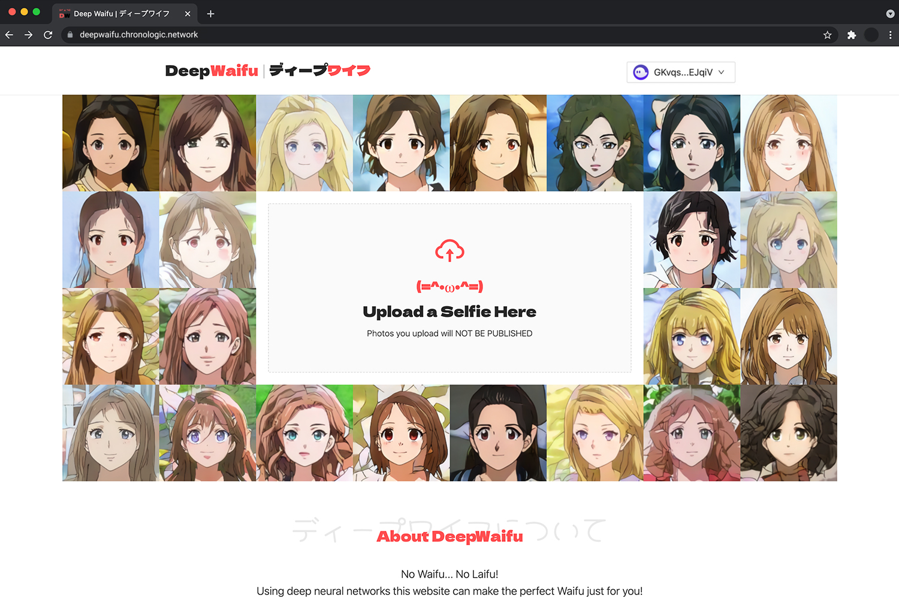

# deep-waifu-ui

This is a part of the [DeepWaifu](https://blog.chronologic.network/no-waifu-no-laifu-we-use-deep-networks-to-draw-your-anime-style-portrait-5fbb0ee6b16a) project.

This repository holds the UI code for the project.

The live version of the dapp can be found [here](https://deepwaifu.chronologic.network/).

## 🗺 Project overview

This project consists of the following repositories:

- https://github.com/chronologic/deep-waifu-ui (this repository)
- https://github.com/chronologic/deep-waifu-server
- https://github.com/chronologic/deep-waifu-payment-contract
- https://github.com/chronologic/deep-waifu-model

## 👀 Demo video

## 🔧 Environment variables

This repo uses [`dotenv`](https://www.npmjs.com/package/dotenv) to load environment variables.

For development, an `.env` file should be created based on the `.env.example` template file. The `.env` file should never be commited.

In production, environment variables can be injected directly.

Below is a list of possible environment variables.

| Name                           | Type     | Default | Description                                                                                                                                                                                                                                                                                                                             |
| ------------------------------ | -------- | ------- | --------------------------------------------------------------------------------------------------------------------------------------------------------------------------------------------------------------------------------------------------------------------------------------------------------------------------------------- |
| `REACT_APP_API_URL`            | `string` |         | URL to [DeepWaifu Server](https://github.com/chronologic/deep-waifu-server)                                                                                                                                                                                                                                                             |
| `REACT_APP_SHARE_URL`          | `string` |         | Base URL for sharing minted waifus on social media. The share URL is a static website with OG data . The website is served by [DeepWaifu Server](https://github.com/chronologic/) so this may be set to the same value as `REACT_APP_API_URL` but we exposed the Server at another (nicer) URL for the purpose of social media sharing. |
| `REACT_APP_SOLANA_ENV`         | `string` |         | Solana network the server should connect to (`devnet`/`testnet`/...)                                                                                                                                                                                                                                                                    |
| `REACT_APP_PAYMENT_PROGRAM_ID` | `string` |         | Public key of [DeepWaifu Payment Contract](https://github.com/chronologic/deep-waifu-payment-contract)                                                                                                                                                                                                                                  |
| `REACT_APP_PAYMENT_TOKEN_MINT` | `string` |         | Mint address of an [SPL Token](https://spl.solana.com/token) that can be used as alternative form of payment for minting the NFT.                                                                                                                                                                                                       |
| `REACT_APP_STRIPE_PUBLIC_KEY`  | `string` |         | Public API key for [Stripe](https://stripe.com/docs/api/authentication) payment service. This is used in the pillow purchase flow.                                                                                                                                                                                                      |
| `REACT_APP_PILLOW_PRICE_USD`   | `number` |         | The price of the pillow in USD.                                                                                                                                                                                                                                                                                                         |

## 💽 Installation

Run `npm install`

## 🚧 Building

Run `npm run build`

## 👷 Development

Run `npm start`
